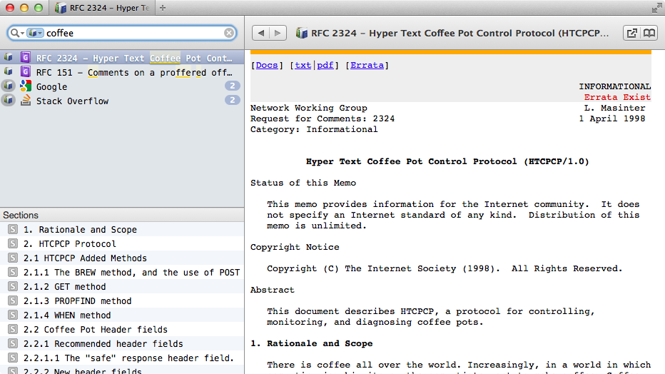

rfcdash
=======

rfcdash is a docset for [Dash.app][] containing all published RFCs from the IETF.

Installing
----------

Install by opening Dash.app preferences, switch to `Downloads`, click `+`, and enter the feed URL
`https://raw.githubusercontent.com/willnorris/rfcdash/master/RFCs.xml`.  The unpacked docset will
take a little over 500 MB on disk.

Updates
-------

I'm still working on putting together the scripts to update this docset.  In the meantime, if you
notice that it is missing an RFC that you need, just [open an issue][] and I'll manually update
things.

[Dash.app]: http://kapeli.com/dash
[open an issue]: https://github.com/willnorris/rfcdash/issues
